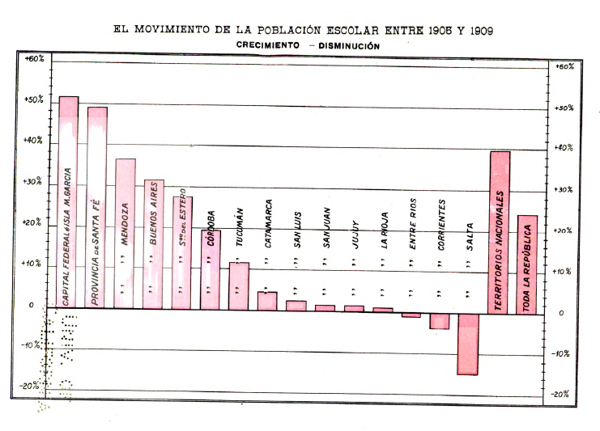
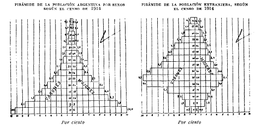
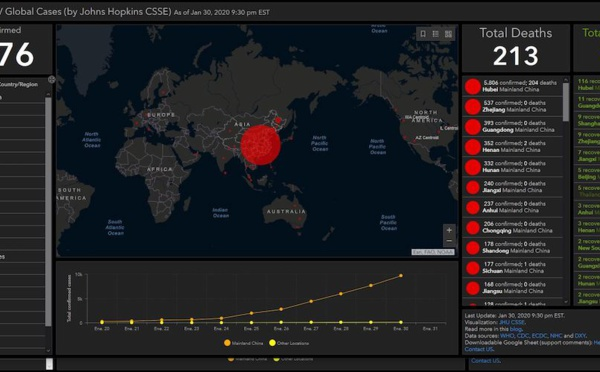
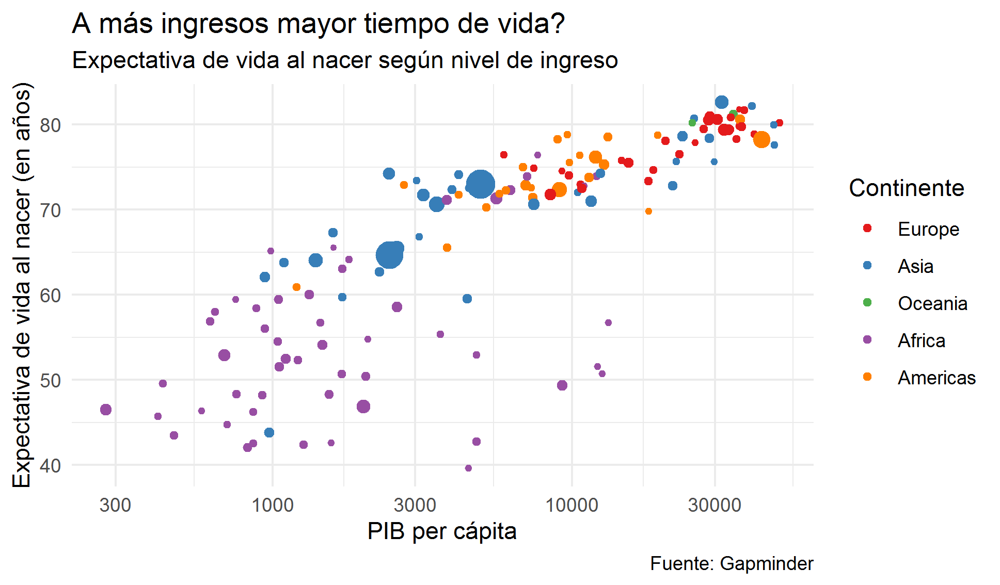
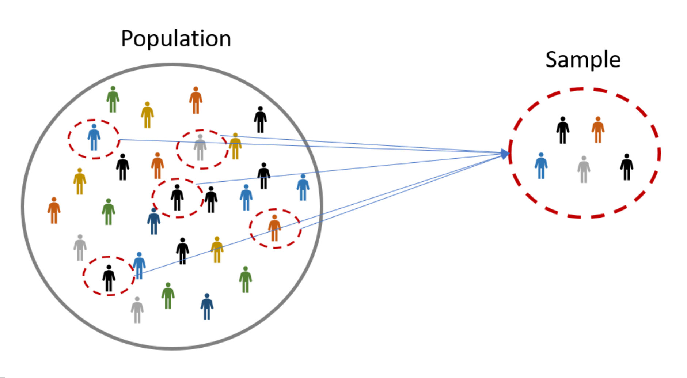
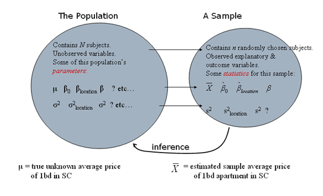
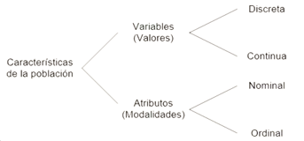
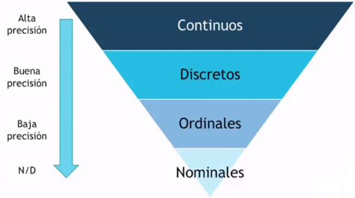

class: inverse, middle

```{r Setup, include = F}
options(htmltools.dir.version = FALSE)
library(pacman)
p_load(leaflet, ggplot2, ggthemes, viridis, dplyr, magrittr, knitr)
# Define pink color
red_pink <- "#e64173"
turquoise <- "#20B2AA"
orange <- "#FFA500"
grey_dark <- "grey20"
# Notes directory
dir_slides <- "~/01Intro/"
# Knitr options
opts_chunk$set(
  comment = "#>",
  fig.align = "center",
  fig.height = 7,
  fig.width = 10.5,
  # dpi = 300,
  # cache = T,
  warning = F,
  message = F
)
theme_empty <- theme_bw() + theme(
  line = element_blank(),
  rect = element_blank(),
  strip.text = element_blank(),
  axis.text = element_blank(),
  plot.title = element_blank(),
  axis.title = element_text(size = 16),
  legend.position = "none"
)
```


# Introducción

---
# Introducción

```{r img-intro1, out.width="90%", fig.align="center",echo = F}

```

---
# Introducción

```{r img-intro2, out.width="90%", fig.align="center", echo = F}

```

---
# Introducción

```{r img-covid, out.width="90%", fig.align="center", echo = F}

```

---
# Introducción

```{r img-hansRos, out.width="90%", fig.align="center", echo = F}

```

The [.mono[Joy of Stats]](https://www.youtube.com/watch?v=jbkSRLYSojo).

[.mono[Gapminder]](https://www.gapminder.org/).

---

# .mono[R] (.mono[ggplot2])

```{R, example: ggplot2 v2, echo = F, dev = "svg"}
# Load packages
library(gapminder); library(dplyr)
# Create dataset
ggplot(
  data = filter(gapminder, year %in% c(1952, 2002)),
  aes(x = gdpPercap, y = lifeExp, color = continent, group = country)
) +
geom_path(alpha = 0.25) +
geom_point(aes(shape = as.character(year), size = pop), alpha = 0.75) +
scale_x_log10("GDP per capita", label = scales::comma) +
ylab("Life Expectancy") +
scale_shape_manual("Year", values = c(1, 17)) +
scale_color_viridis("Continent", discrete = T, end = 0.95) +
guides(size = F) +
theme_pander(base_size = 16)
```

---

# .mono[R] (.mono[ggplot2])

```{R, example: ggplot2 v2 code, eval = F}
# Load packages
library(gapminder); library(dplyr)

# Create dataset
ggplot(
  data = filter(gapminder, year %in% c(1952, 2002)),
  aes(x = gdpPercap, y = lifeExp, color = continent, group = country)
) +
geom_path(alpha = 0.25) +
geom_point(aes(shape = as.character(year), size = pop), alpha = 0.75) +
scale_x_log10("GDP per capita", label = scales::comma) +
ylab("Life Expectancy") +
scale_shape_manual("Year", values = c(1, 17)) +
scale_color_viridis("Continent", discrete = T, end = 0.95) +
guides(size = F) +
theme_pander(base_size = 16)
```

---

# .mono[R] + gráficos animados (.mono[gganimate])

```{R, example: gganimate, include = F, cache = T, eval = F}
# The package for animating ggplot2
library(gganimate)
# As before
gg <- ggplot(
  data = gapminder %>% filter(continent != "Oceania"),
  aes(gdpPercap, lifeExp, size = pop, color = country)
) +
geom_point(alpha = 0.7, show.legend = FALSE) +
scale_colour_manual(values = country_colors) +
scale_size(range = c(2, 12)) +
scale_x_log10("GDP per capita", label = scales::comma) +
facet_wrap(~continent) +
theme_pander(base_size = 16) +
theme(panel.border = element_rect(color = "grey90", fill = NA)) +
# Here comes the gganimate-specific bits
labs(title = "Year: {frame_time}") +
ylab("Life Expectancy") +
transition_time(year) +
ease_aes("linear")
# Save the animation
anim_save(
  animation = gg,
  filename = "ex_gganimate.gif",
  path = dir_slides,
  width = 10.5,
  height = 7,
  units = "in",
  res = 150,
  nframes = 56
)
```

.center[]
---

# .mono[R] + gráficos animados (.mono[gganimate])

```{R, example: gganimate code, eval = F}
# The package for animating ggplot2
library(gganimate)
# As before
ggplot(
  data = gapminder %>% filter(continent != "Oceania"),
  aes(gdpPercap, lifeExp, size = pop, color = country)
) +
geom_point(alpha = 0.7, show.legend = FALSE) +
scale_colour_manual(values = country_colors) +
scale_size(range = c(2, 12)) +
scale_x_log10("GDP per capita", label = scales::comma) +
facet_wrap(~continent) +
theme_pander(base_size = 16) +
theme(panel.border = element_rect(color = "grey90", fill = NA)) +
# Here comes the gganimate-specific bits
labs(title = "Year: {frame_time}") +
ylab("Life Expectancy") +
transition_time(year) +
ease_aes("linear")
```

---
# Introducción

Antes del siglo XVII, la estadística existía principalmente en el ámbito de los mapas, mostrando marcadores de tierra, ciudades, carreteras y recursos. A medida que crecía la demanda de mapeo y medición física más precisos, se necesitaban mejores visualizaciones.

--

En la era actual, se presentan dificultades de **clasificar grandes cantidades de información (Big Data), dar sentido a los números y estadísticas y encontrar la forma de comunicar esos datos** de una manera fácil de comprender, pues no es sencillo si no se sabe por dónde empezar.

---
class: inverse, middle

# ¿Qué es la estadística?

---
# ¿Qué es la estadística?

Es la ciencia que se encarga de la **(1) recolección, (2) organización, (3) análisis e (4) interpretación de datos**. Así pues, la importancia de la misma está direccionada a:

--

1. Investigación científica
2. Formulación de políticas públicas
3. El campo de la medicina
4. Programas sociales
5. Investigación de mercados
6. Diversos fenómenos

---
# Propósito y definición

Su propósito es responder a la necesidad de un manejo práctico de sus métodos en la producción científica y facilitar la comprensión y lectura de investigaciones realizadas.

--

La Estadística según **Cortada y Carro (1970)** es *"una manera de pensar y tratar la problemática de la realidad en forma elaborada, consistente y exacta, dando criterios de decisión"*.

--

**Estadística** es un conjunto de procedimientos y principios para obtener y procesar información con el fin de tomar decisiones frente a la incertidumbre.

--

Se estudian técnicas para:

- **Estimar parámetros**
- **Ajustar modelos**
- **Probar hipótesis**

---
# Definiciones

.pink-box[
**Estadística descriptiva o deductiva**

Tiene como finalidad colocar en evidencia aspectos característicos del grupo (promedios, variabilidad de los datos, etc.) que sirven para realizar comparaciones, **sin pretender sacar conclusiones de tipo más general**. Se realiza mediante cuadros, gráficos, cálculo de promedios, proporciones, varianzas de una o más variables relacionadas.
]

--

.pink-box[
**Estadística inferencial o inductiva**

Busca dar explicaciones al comportamiento de un conjunto de observaciones, probar la significación o validez de los resultados, y descubrir las causas que lo originan — de gran aplicación en el muestreo, logrando **obtener conclusiones que se extienden más allá de las muestras estadísticas mismas**.
]

---
# Estadística descriptiva e inferencial

.pull-left[
**Estadística descriptiva**

Se enfoca en procedimientos gráficos y numéricos usados para **resumir y procesar** datos.
]

.pull-right[
**Estadística inferencial**

Se enfoca en usar los datos para hacer **predicciones, pronósticos y estimaciones** que mejoren la toma de decisiones.
]

--

Pensar estadísticamente comienza con la definición del problema: 
1. ¿qué información se requiere? 
2. ¿cuál es la población relevante? 
3. ¿cómo se seleccionan los miembros de la muestra? 
4. ¿cómo se obtiene la información?

---
# Preocupaciones principales

La Estadística se ocupa del **análisis de datos**: usar los datos para hacer inferencias.

Se pregunta: *¿qué me están diciendo estos datos?* y *¿qué es razonable creer a partir de ellos?*

Sus dos preocupaciones principales son:

1. **Estimación de parámetros**
2. **Prueba de hipótesis**

---

# Ejemplo: Estimando una proporción

Supongamos que queremos estimar la proporción $p$ de estudiantes en la UAGRM que no se han bañado en más de un día.

**Preguntas que surgen:**

- ¿A qué nos referimos con "estudiantes"?
- Si el tiempo es limitado y solo podemos entrevistar a 20 personas en el campus, ¿importa que la muestra sea **aleatoria**? ¿Cómo lo garantizamos?
- ¿Los entrevistados sentirán vergüenza de admitirlo?
- ¿Estaríamos satisfechos si la muestra no incluye mujeres, o solo incluye estudiantes de economía?

--

Supongamos que 5 de 20 no se han bañado. Podríamos estimar $p$ con

$$ \hat{p} = 5/20 = 0.25 $$

**Pregunta clave:** ¿qué tan grande podría ser el error de $\hat{p}$?

---
class: inverse, middle

# Finalidades de la estadística

---
# Finalidades de la estadística

- Conocer la realidad de una observación o fenómeno

--

- Determinar lo típico o normal de esa observación (ejemplos de ingresos y enfermedad)

--

- Determinar los cambios que presenta el fenómeno

--

- Relacionar dos o más fenómenos

--

- Determinar las causas que originan el fenómeno

--

- Hacer estimativos sobre el comportamiento futuro del fenómeno

--

- Obtener conclusiones de un grupo menor (muestra) para hacerlas extensivas a un grupo mayor (población) — **Estadística inferencial**

---
# Finalidades de la estadística

La estadística ofrece las mejores técnicas o estrategias para recoger y analizar datos.

¿Para qué?

--

1. **Descriptivo:** describir fenómenos (físico, sociológico, comercial, control de calidad, etc.). *Ej.: el comportamiento del consumidor o intención de voto.*

--

2. **Predictiva:** scoring crediticio, producción agrícola, etc.

--

3. **Explicativa:** algún tipo de intervención genera cambios en la variable de interés. *Ej.: gastos en publicidad y ventas.*

---
class: inverse, middle

# Nociones de Estadística

---

# Población: finita e infinita, y muestra

La Estadística estudia colectivos o poblaciones y las relaciones entre ellos.

La **población, colectivo o universo** es el total de elementos, cosas o personas que forman parte de la investigación.

--

La población puede considerarse por sus elementos como:

- **Población finita:** conjunto numerable de elementos.
- **Población infinita:** conjunto no numerable o forma línea continua de puntos. Distinción teórica, ya que siempre se trata con poblaciones de números finitos de elementos.

La **muestra** es un subconjunto representativo de la población.

---

# Muestra representativa

```{r img-population, out.width="85%", fig.align="center", echo=FALSE}

```


---
# Población vs. muestra

```{r img-sample, out.width="90%", fig.align="center", echo = F}

```


---

# Población vs. muestra

1. **Población:** conjunto de todas las observaciones de interés para el investigador.

--

2. **Parámetro:** medida descriptiva de la población.

--

3. **Muestra:** parte representativa de la población que se selecciona para ser estudiada, ya que la población es demasiado grande como para analizarla en su totalidad.

--

4. **Estadístico:** medida descriptiva de la muestra; sirve como estimación del parámetro de la población correspondiente.

--

5. **Variable:** es una característica específica (como edad o peso) de un individuo u objeto.

---

# Características de las unidades 


**Características (o caracteres):** rasgos, cualidades o propiedades que poseen los elementos que constituyen la población o la muestra. Pueden ser cualitativas o cuantitativas — de ahí la distinción en *variable* o *atributo*.

--

- **Cualitativos o atributos:** se expresan mediante palabras por no ser mensurables, pero sí cuantificables. Pueden ser:

--

  - **Ordinales:** referentes al sentido de jerarquía u organización de elementos.
  
--

  - **Nominales:** rasgos sin capacidad de ordenación.
  
--

Las clasificaciones que pueden adoptar los atributos se llaman *modalidades o categorías*. Los atributos se designan con letras mayúsculas iniciales (A, B, C...); sus modalidades con minúsculas (a, b, c...).

---

# Clasificación de las variables 

- **Cuantitativos o variables:** son mensurables y se describen numéricamente. *Ejemplo:* peso, edad, altura, etc.

--

Las variables pueden ser:

--

- **Variable discreta:** solo puede tomar determinados valores, siendo imposible tomar valores intermedios entre dos consecutivos — toma únicamente valores enteros: 1, 2, 3, etc.

--

- **Variable continua:** toma todos los valores infinitos posibles en un intervalo — se admiten valores fraccionarios.

--

Las variables se designan con las últimas letras mayúsculas del abecedario (X, Y, Z...) y sus valores con minúsculas (x, y, z...).

---
# Resumen

```{r img-caracteristicas, out.width="80%", fig.align="center", echo = F}

```

---

# Clasificación de las variables

Las variables también se pueden clasificar en:

- **Unidimensionales:** si solo recogen información sobre una característica.

--

- **Bidimensionales:** si recogen información sobre dos características de la población.

--

- **Pluridimensionales:** si recogen información sobre tres o más características.

---

# Escalas de medida

Las distintas **características de la población a investigar deben ser medidas adecuadamente**, atendiendo a los siguientes niveles de medición:

--

**Escala Nominal.** Es el nivel más primitivo, bajo y limitado de medición. Hace referencia a datos que solo pueden clasificarse en categorías, sin intervención de mediciones o escalas, solo mediante conteos. No existe orden particular para los grupos.

--

**Escala Ordinal.** Tiene las características del nivel anterior, pero difiere en que las categorías pueden ordenarse en una relación "mayor que".

---

# Escalas de medida

**Escala de Intervalos.** Incluye todas las características de la escala ordinal, pero además la distancia entre valores es de tamaño conocido y constante. Es el nivel de medición para variables discretas o continuas.

*Ejemplo:* medición de temperatura en la escala centígrada. El punto cero es arbitrario (0 °C); no significa ausencia de temperatura, sino un estado de frío. Si se registraron 30 °C y 60 °C, hubo una temperatura 30 °C más cálida, pero no se puede afirmar que hizo dos veces más calor.

---

# Escalas de medida

**Escala de Razón.** Es el nivel de medición más alto y sirve para variables discretas y continuas. Diferencias principales respecto al nivel anterior:

- Los datos de nivel de razón tienen un punto cero significativo.
- La razón o cociente de dos números es significativa.

*Ejemplo:* el dinero. Tener cero pesos tiene un significado: no tengo nada de dinero. Si una persona gana USD1.000 y otra USD4.000, la segunda gana 4 veces más que la primera.

---
# Escalas de medida

```{r img-escala, out.width="90%", fig.align="center", echo = F}

```

---
layout: false
class: inverse, middle

# Proceso de elaboración de una investigación estadística (EIE)

---
# Fases del proceso de EIE

1. <span style="color:#e64173">**Planeamiento o preparación**</span>
2. Recolección
3. Crítica y codificación — clasificar qué material sirve
4. Tabulaciones o procesamiento
5. <span style="color:#e64173">**Análisis e interpretación**</span> (numérico y gráfico)
6. Publicación

---
# Aspectos del planeamiento de la IE

1. **El objeto de investigación**
   - Definir objeto de la investigación
   - Determinar naturaleza cuantitativa o cualitativa
   - Determinar la posibilidad de la investigación
   - Limitar el objeto y campo de la investigación

2. **La finalidad**

3. **La fuente de información:** directa, indirecta, primaria, secundaria, interna, externa

4. **Los procedimientos**

5. **El material**

6. **Los costos y su financiamiento**

---
# Aspectos del análisis e interpretación de datos

- Elaboración de distribuciones o tablas de frecuencia.
- Presentación de cuadros y gráficos.
- Cálculo de porcentajes, proporciones, estimadores puntuales o parámetros. Presentación de medidas de tendencia central, de dispersión, de deformación y de apuntamiento.

---
# *The great workhorse* de la ED

Así pues, se pretende utilizar los caballos de batalla de la estadística descriptiva:

- Análisis de distribuciones de frecuencia
- Análisis de los momentos de la distribución de una variable:
  - Medidas de posición y tendencia central
  - Medidas de dispersión
  - Medidas de deformación
  - Medidas de apuntamiento

---
layout: false
class: inverse, middle

# Siguiente: Naturaleza de la información (agrupación y presentación de datos)

---
exclude: true

```{R, print pdfs, echo = F, eval = T}
pagedown::chrome_print(input = "01-intro.html")
```

